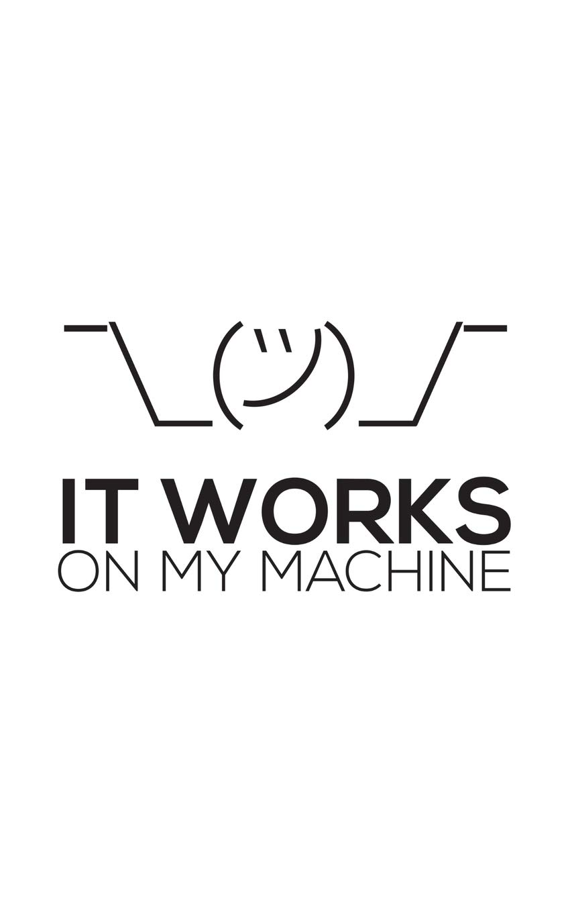
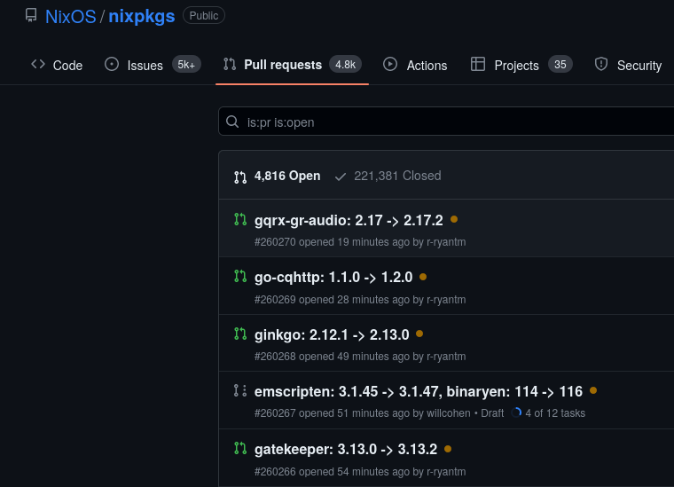
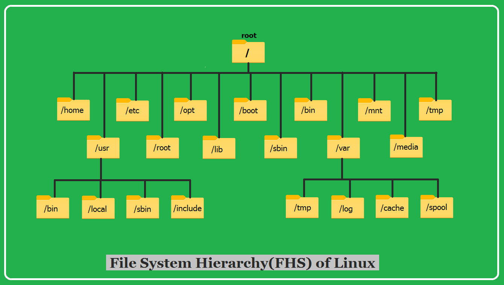
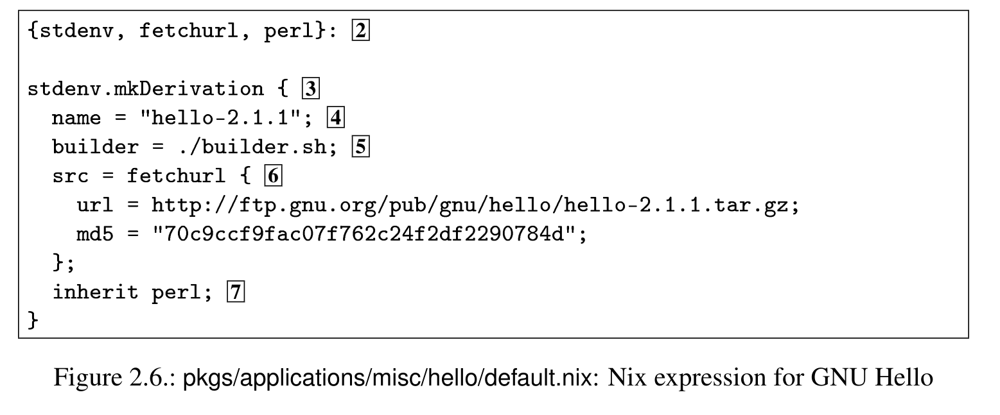
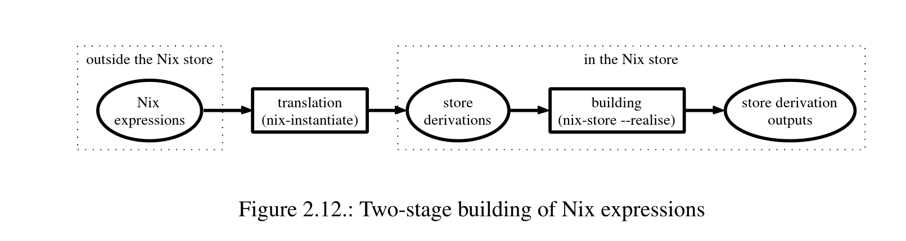
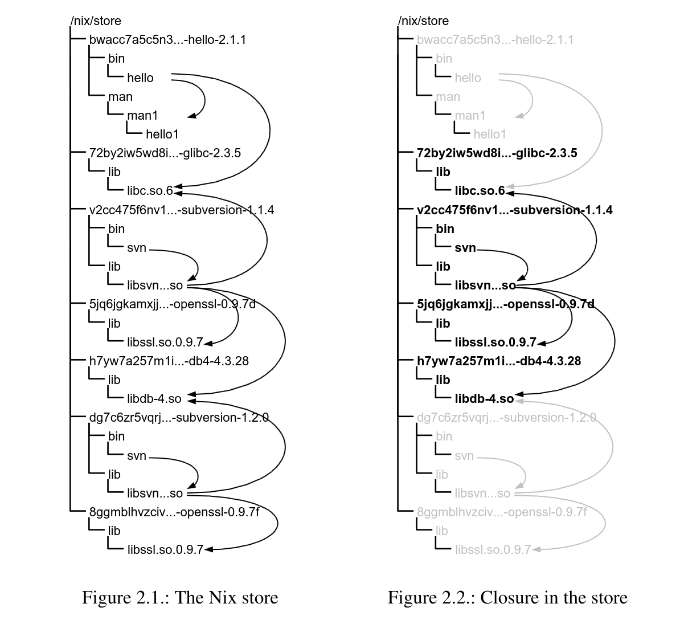
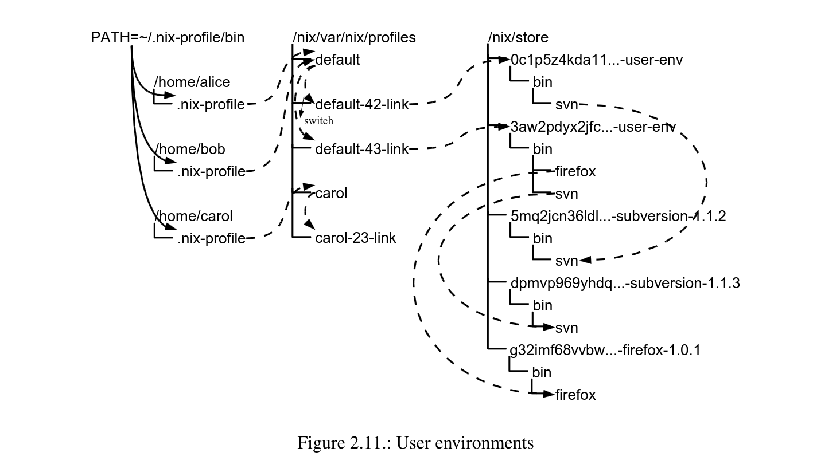
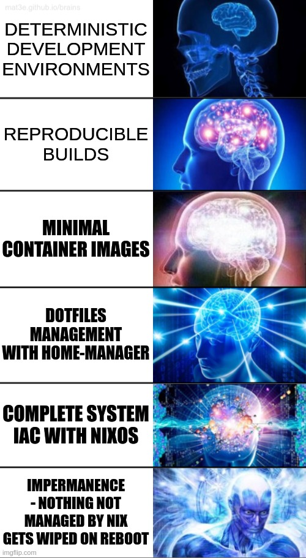

# Deterministiska byggen med Nix

How I learned to love the dev shell 🤘

---



---

# Dev containers
* Containerize development environment, packages, environment variables, etc.
* Every developer (preferably) uses the exact same packages
* Documentation for setting up dev environment always up to date
  * Fast onboarding of new devs

---


# Docker? (for image builds)
* Security, hard to verify actual contents
* Performance, poor use of caching
* Bloated: works in layers, not software features
* Requires internet access
  * No hermetic builds ... more on that later ...

<!-- Poor software bill of materials -->
<!-- Caching, Nix does a much better job -->
<!-- Build commands in Dockerfiles end up as metadata in the resulting image -->

---

# Reproducible?

```dockerfile
FROM ubuntu

RUN set -eux;
	apt-get update;
	apt-get install -y --no-install-recommends \
		ca-certificates \
		curl \
	; \
	rm -rf /var/lib/apt/lists/*

COPY . /app

CMD /app/app
```
<!-- ubuntu what? -->
<!-- Chain commands to follow best practices -->
<!-- apt-get is non determenistic/temporal -->
<!-- How is app even built and what version/packages was used?  -->

---

# Reproducible?

```dockerfile
FROM ubuntu # Ubuntu what exactly?

RUN set -eux;
	apt-get update; # apt-get is non determenistic and temporal
	apt-get install -y --no-install-recommends \
		ca-certificates \
		curl \
	; \
	rm -rf /var/lib/apt/lists/* # Cleaning up our garbage I see

COPY . /app # What environment even built this???

CMD /app/app
```
<!-- ubuntu what? -->
<!-- Chain commands to follow best practices -->
<!-- apt-get is non determenistic/temporal -->
<!-- How is app even built and what version/packages was used?  -->

---

# Reproducible?

* 2 people using the same docker image => same results
* 2 people building the same Dockerfile => (very often) different results
* Non dev container scenarios even worse
  * Different distros, slight differences in libraries/build flags etc.

---

# Nix package manager


* Cross platform reproducible package manager and build system
  * (*nix, MacOS, WSL)
* PhD thesis project by Eelco Dolsta (2006)
  * First stable release in 2012
* Atomic upgrades
* Rollbacks
* Concurrent installations

<!-- Those who use MacOS check out nix-darwin -->

---

# Nix - language
* Functional and pure
  * Everything is an expression
* Lazy
* Declarative
* Domain specific ... Haskell like

<!-- Domain specific but turing complete, not a suitable as a general purpose language -->

---

# Basic Python + Web dev shell

```nix
{ pkgs ? import <nixpkgs> {}}:
pkgs.mkShell {
  buildInputs = [
    pkgs.python3
    pkgs.python3Packages.virtualenv
    pkgs.nodejs
    pkgs.yarn
  ];
}
```

---

# Dotnet?

```nix
{ pkgs ? import <nixpkgs> {}}:
  pkgs.mkShell {
    buildInputs = with pkgs; [
      (with dotnetCorePackages;
        combinePackages [
          sdk_7_0
          sdk_6_0
        ])
      netcoredbg
      omnisharp-roslyn
    ];
  }
```

---

# NixOS - distribution
* Full GNU/Linux distribution implemented by nix
* MSc thesis project by Armijn Hemel (2006)
* Uses nix as both a package and configuration manager
* Fully leverages the nixpkgs monorepo ...

---


---

<style scoped>
section {
  background: #0D1117;
}
</style>



---

# How does it work?!

---



---

# FHS
* Lends itself poorly for reproducibility:
  * /lib/libudev.so ... bad
  * /lib/libudev.so.1.6.3 ... better but many unknowns like build flags
  * What if we want different versions of the same library?

---

# Nix build process
* Compute a package derivation based on some nix expression ex `default.nix`. This file includes:
  * mentions of all the files and other packages that will be required during the build
  * build instructions for actually building the package,
  * some meta-information about the package,
  * a store path (prefix) under which the package will be installed
    * /nix/store/<hash>-<name>-<version>
    * ex. **/nix/store/d29dgx2kc94dlq8h85phzlx01x7ajhjv-firefox-118.0.1**/bin/firefox

<!-- 160 bit hash used for path (32 chars) -->
<!-- derivation + all inputs determines the hash, secret sauce in caching -->
<!-- Memory safety paradigm for the file system -->

---



---

```nix
{
  pkgs,
  nuget-packageslock2nix,
}:
pkgs.buildDotnetModule {
  pname = "dotnetapp";
  version = "1.0.0";

  projectFile = "DotnetApp.csproj";
  nugetDeps = nuget-packageslock2nix.lib {
    system = "x86_64-linux";
    name = "dotnetapp";
    lockfiles = [
      ./packages.lock.json
    ];
  };

  src = ./.;

  dotnet-sdk = pkgs.dotnetCorePackages.sdk_7_0;
  dotnet-runtime = pkgs.dotnetCorePackages.aspnetcore_7_0;
  selfContainedBuild = false;

  useDotnetFromEnv = true;

  meta = with pkgs.lib; {
    homepage = "My website";
    description = "My awesome app";
    license = licenses.mit;
  };
}
```

---



---



---



<!-- Demo time -->

---

# Pros
* Reproducibility ... duh
* Binary caching, hash can be calculated beforehand
* Multiple version simultaneously
* Hermetic/isolated builds
* Small footprint/backups

<!-- Meme slide ahead -->

---


---

# Cons?
* Steep learning curve
  * New toolchain
  * New language
* Many existing tools/projects may not be suitable for reproducibility in current form
* Accumulates a lot of packages/versions
  * Garbage collection included in tooling 🗑️
* Documentation (organization) could be better
* Very powerful ... but more powerful if everyone in a team uses it

---

# Where to go from here?
* Install nix from `https://nixos.org`
* Read some docs: `https://nix.dev` is a very good resource alongside the official nix manual
* Use nix (`nix-env` + `nix-channel`) to install packages not present on your current distribution
* Play around with `nix-shell` and create some isolated dev shells
* Check out `home-manager` to manage both user packages and dotfiles

---


