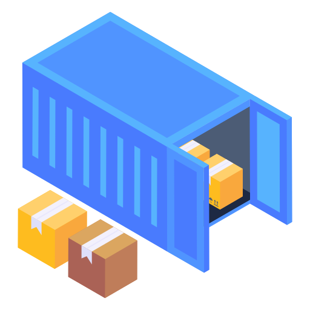
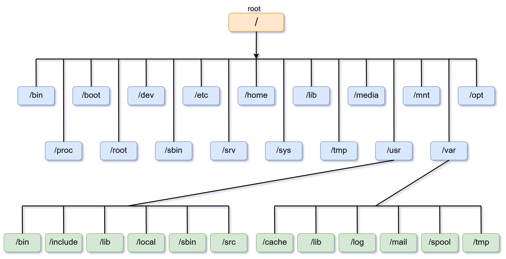
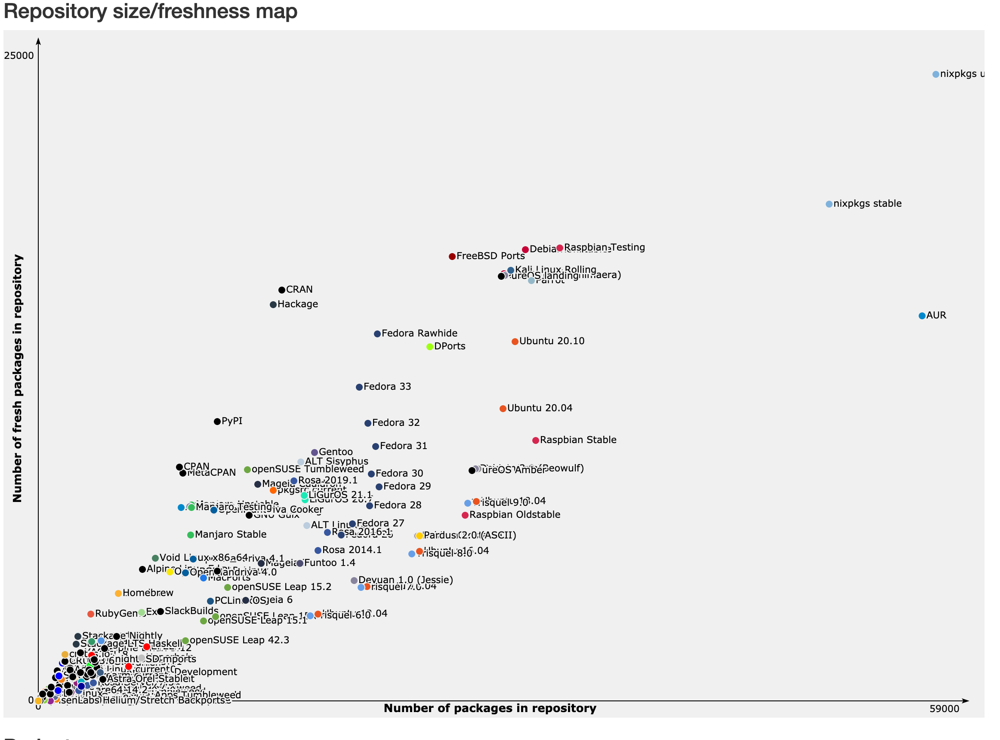

# Do you want to build a snow(flake)?

The road to a better dev environment

---


---


# What do we want?

- Access to as many (up to date) packages/SDKs/toolchains as possible
- Have a way of restoring the exact same package state on multiple machines
  - Including config/env variables
- Way of keeping inventory of what we use
  - Both a resource and security concern
    Using as few tools as possible ...

---



# Dev containers

- Containerize development environment, packages, environment variables, etc.
- Every developer (preferably) uses the exact same packages
- Documentation for setting up dev environment always up to date
  - Fast onboarding of new devs

---


# Docker? (for image builds)

- Security, hard to verify actual contents
- Performance, poor use of caching
- Bloated: works in layers, not software features
- Requires internet access to work

<!-- Poor software bill of materials -->
<!-- Caching, Nix does a much better job -->
<!-- Build commands in Dockerfiles end up as metadata in the resulting image -->

---

# Reproducible?

```dockerfile
FROM ubuntu

RUN set -eux;
	apt-get update;
	apt-get install -y --no-install-recommends \
		ca-certificates \
		curl \
	; \
	rm -rf /var/lib/apt/lists/*

COPY . /app

CMD /app/app
```

<!-- ubuntu what? -->
<!-- Chain commands to follow best practices -->
<!-- apt-get is non determenistic/temporal -->
<!-- How is app even built and what version/packages was used?  -->

---

# Reproducible?

```dockerfile
FROM ubuntu # Ubuntu what exactly?

RUN set -eux;
	apt-get update; # apt-get is non deterministic and temporal
	apt-get install -y --no-install-recommends \
		ca-certificates \
		curl \
	; \
	rm -rf /var/lib/apt/lists/* # Cleaning up our garbage I see

COPY . /app # What environment even built this???

CMD /app/app
```

---


# Reproducible?

- 2 people using the same docker image => same results
- 2 people building the same Dockerfile => (very often) different results
- Non dev container scenarios even worse
  - Different distros, slight differences in libraries/build flags etc.

---

# Nix


- Cross platform reproducible package manager and build system
- PhD thesis project by Eelco Dolsta (2006)

---


# Works on

- \*nix like operating systems
- WSL
- MacOS
- NixOS - distro built entirely on Nix

---


# Features

- Concurrent and isolated installations of software
- Atomic upgrades
- Rollbacks
- Reproducible!

---

# How does it work?

---

<!-- _backgroundColor: #ffffff -->



---


# The File System Hierarchy standard

- Lends itself poorly for reproducibility:
  - /lib/libudev.so ... bad
  - /lib/libudev.so.1.6.3 ... better but many unknowns like build flags
  - What if we want different versions of the same library?

---

Instead of ...

```
/usr/bin/python
```

... Nix uses a deterministic hash

```
/nix/store/3lll9y925zz9393sa59h653xik66srjb-python3-3.13.9/bin/python
```

- Hashes are decided based on build inputs
- Dynamic linking strictly controlled
- Programs installations can never interfere with one another

---


---


---

# Nix

```nix
{ pkgs }:
{
  services.timesyncd.enable = true;

  programs = {
    dconf.enable = true;
    git.lfs.enable = true;
    ssh.startAgent = true;
  };

  environment.systemPackages = with pkgs; [
    awscli2
    duckdb
  ];
}
```

---

# Nix is a programming language

```nix
  fib = n:
    let
      acc = a: b: i:
        if i == n then a else acc b (a + b) (i + 1);
    in
    if n < 2 then n else acc 0 1 0;
```

---

# Nix

- Functional and pure
  - Everything is an expression
- Lazy
- Declarative
- ... it's like Haskell and json had a baby ...

---

# NixPkgs

The largest software repository in the world

https://github.com/NixOS/nixpkgs

---



---


# Development shells

- The Nix answer to dev containers
- Clever use of env variables and symlinks construct the exact desired environment
- Can be likened to starting a shell ... like bash for example

---

# Basic dotnet shell

```nix
{
  pkgs ? import <nixpkgs> {}
}:
pkgs.mkShell {
  buildInputs = with pkgs; [
    (with dotnetCorePackages;
      combinePackages [
        sdk_8_0
        sdk_10_0
      ])
    netcoredbg
    omnisharp-roslyn
  ];
}
```

---


# Flakes

- Effort to modernize nix projects with better tooling
- Provides well defined entrypoints for programs and tools
- Allows pinning of dependencies
- Essentially a function taking inputs and producing outputs
- Unfortunately not fully stabilized in Nix as of yet

---

# Basic flake

```nix
{
  description = "A very basic flake";

  inputs = {
    nixpkgs.url = "github:nixos/nixpkgs?ref=nixos-unstable";
  };

  outputs = { self, nixpkgs }:
    {
      packages.x86_64-linux.hello = nixpkgs.legacyPackages.x86_64-linux.hello;
      packages.x86_64-linux.default = self.packages.x86_64-linux.hello;
    };
}
```

---

# Some popular projects using Flakes

- Zed Editor
- Helix Editor
- Open Code
- Polars
- rust-analyzer
- Cosmic Desktop
- Hyprland
- zoxide

---

# Home-Manager

- System for generating NixOS like configurations on generic Linux distributions
- The "best" way to install packages outside of NixOS
- Powerful dotfiles manager

---


---

# The good

- Fully deterministic and reproducible software
  - No hidden gotchas, when it works it continues to work
- Cross platform package manager
- Portable development environments
- Rollbacks, easy to revert since software is described as code

---

# The less good

- Steep learning curve
- Documentation (organization) could be better
  - Surprisingly good answers from LLMs ...
- Sometimes hard to migrate software builds to deterministic behavior
- Storage and network heavy

---

# Goals/Milestones

1. Install and try out Nix on your distro of choice
2. Install packages from Nix when not available in your regular package manager
3. Use a Nix dev shell where it makes sense
4. Use Flakes and Home-Manager to manage your development setup
5. Try NixOS 😉

---

# Let's begin

https://github.com/oahlen/snowflake
