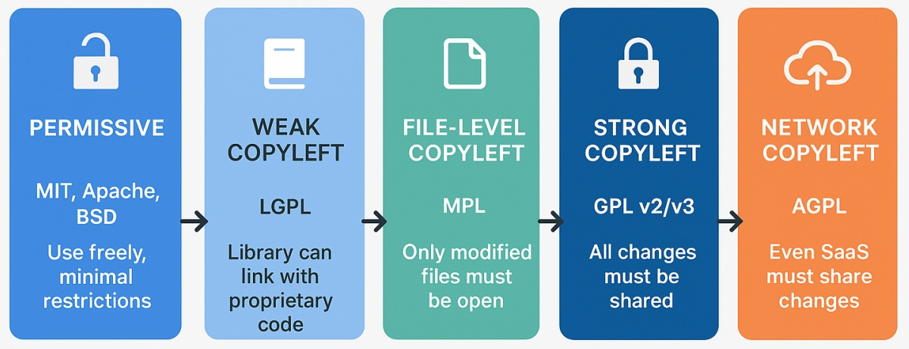
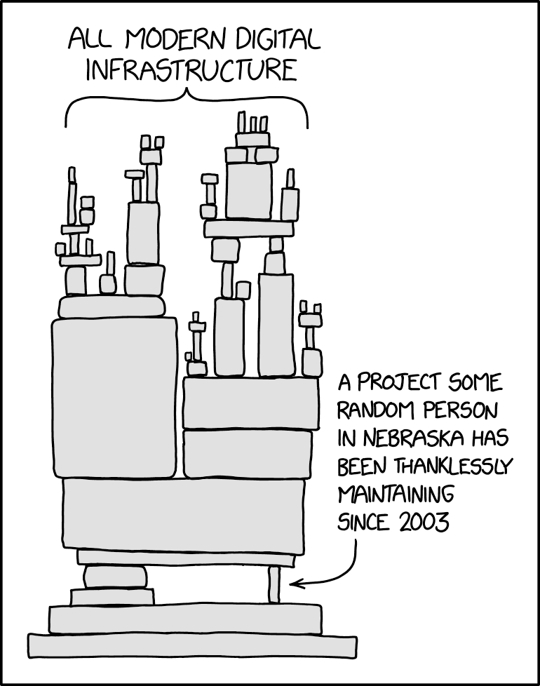
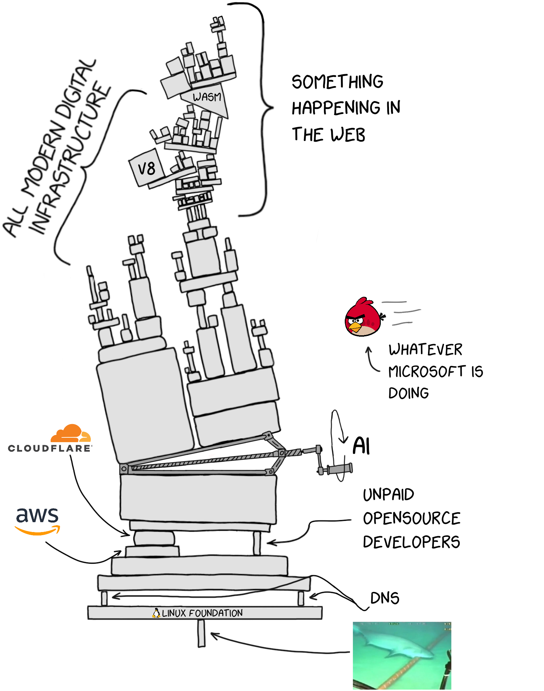
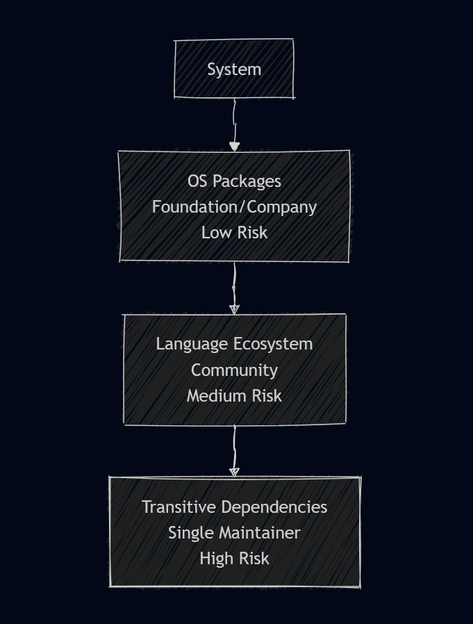

<!-- _class: lead -->

# The Mythical Open Source Supply Chain

---

<!-- _class: lead -->

<!-- Part 1 - Open Source Defintion -->

# Vem använder Open Source?

---

## Open Source finns överallt

Du använder det varje dag

* Din telefon kör Linux (Android) eller en BSD-baserad kärna (iOS)
* Tjänster du använder kör open source databaser och web servrar
* Dina moderna prylar kör open source, Bilar, smart-TV, wearables
* Internets fundament bygger på det: (DNS, HTTP, TLS, etc.)

<!-- We as consultants use it in our daily job -->

---

<!-- _class: lead -->

**There is no "opting out"**

---

## Defintion

Med Open Source står det dig *fritt* att:

* Använda mjukvara oavsett syfte
* Undersöka mjukvaras källkod
* Ändra mjukvarans källkod
* Paketera om eller distribuera mjukvaran

---

<!-- _class: lead -->

> Free as in speech ... not beer

---

<!-- _class: lead -->

## Software is built by Communities

> A group of people sharing the same goals, ideas or values

---

## Motivation

* Svårt (omöjligt) att bygga allt själv
* Lättare att bygga och underhålla något tillsammans
* Man vill bidra eller göra ekosystemet Lättare
* Personliga anledningar - Det är roligt

<!-- Might be considered strange by some -->

---

## Hur fungerar det?

* Frivilla och företag publiserar kod med "permissive licenses"
* Alla kan använda, studera och ändra källkoden
* Bidrag sker genom pull requests, buggrapporter och diskussioner
* Styrning - Allt från one man shows till stiftelser

---

## Organisation

| Modell | Exempel | Utmaningar |
|---|---|---|
| Corporate backed | Kubernetes | Intressekonflikter |
| Stiftelser | Linux, Apache | Kostnader / Ekonomi |
| Multi-licens | Redis, MongoDB | Splittring |
| Donationer / sponsring | curl | Burnout |

---

## Läs licenstexten ...

```
MIT License

Copyright (c) 2026 John Open Source

Permission is hereby granted, free of charge, to any person obtaining a copy
of this software and associated documentation files (the "Software"), to deal
in the Software without restriction, including without limitation the rights
to use, copy, modify, merge, publish, distribute, sublicense, and/or sell
copies of the Software, and to permit persons to whom the Software is
furnished to do so, subject to the following conditions ...
```

---



<!-- License types -->

---

<!-- Part 2 - Supply Chain Myth -->


---

## Leveranskedja

* Naturligt språk när vi pratar om tillverkning
* Känns intuitivt att applicera på mjukvara
* Ett vanligare språkbruk efter kända incidenter/säkerhetshål
* Passar bra in på hur företag och myndigheter benämner beroenden

---

## Missförståndet

```
THE SOFTWARE IS PROVIDED "AS IS", WITHOUT WARRANTY OF ANY KIND, EXPRESS OR
IMPLIED, INCLUDING BUT NOT LIMITED TO THE WARRANTIES OF MERCHANTABILITY,
FITNESS FOR A PARTICULAR PURPOSE AND NONINFRINGEMENT. IN NO EVENT SHALL THE
AUTHORS OR COPYRIGHT HOLDERS BE LIABLE FOR ANY CLAIM, DAMAGES OR OTHER
LIABILITY, WHETHER IN AN ACTION OF CONTRACT, TORT OR OTHERWISE, ARISING FROM,
OUT OF OR IN CONNECTION WITH THE SOFTWARE OR THE USE OR OTHER DEALINGS IN THE
SOFTWARE.
```

---



<!-- Classic from XKCD -->

---

<!-- _class: lead -->

Du har ingen levernatör men kanske en **välgörare**

*Supply Chain* implicerar förpiktelser som inte existerar

---



---

## Jämförelse

| Supply chain | Open source |
|---|---|
| Kontraktsbaserat | Frivilligt bidrag |
| Garanti och ansvar | - |
| Kvalitetskontroll | Best-effort, god vilja |
| Jag betalar, du levererar | Jag tar, du ger |


<!-- Risk för compliance theater -->
<!-- Onödigt stress på obetalda utvecklare -->
<!-- Viktigare med audits än att bidra och förbättra -->
<!-- Försämrar open source som helhet -->

---

---

<!-- Part 3 - Security Perspective -->


---

## Incidenter

* **Heart Bleed (2014)** - Bugg i TLS; angripare kunde exfiltera information ur webservrar
* **Log4Shell (2021)** - Log4j; remote code execution genom populärt loggramverk
* **XZ Utils Backdoor (2024)** - Social engineering attack mot en utbränd maintainer
* Inte alltid uppenbart att du som användare är exponerad.

---

## Ska man orora sig?

* I större open source projekt tas säkerhet generellt seriöst
* Lång CVE-lista ofta ett tecken på transparens/genomögad kod
* Linux - korta ledtider för patching; bättre än många kommerciella aktörer
* ... men allt är en fråga om resurser

<!-- A proprietary product with fewer CVEs may simply have fewer people looking -->

---

<style scoped>
section {
  background: #030817;
}
</style>



---

<!-- Part 4 - AI and Open Source -->


---

## Elefanten i rummet

* LLMs har tränats till stor del på öppen källkod
* AI-företag har gjort stora vinster på allmänhetens arbete
* Vad säger egentligen licenserna om det här?

---

## AI och Open Source

* AI bidrar nu aktivt till öppna källkodsprojekt
* Kvalitet varierar ... hur man använder det ...
* Ökad press på maintainers
* Mer kod, lika många eller färre reviewers

---

## Risker

* AI duktig på att hitta sårbarheter -> fördel angripare
* 
* Hinner vi med?

- Attackers use AI to find vulnerabilities faster
- Synthetic personas for social engineering (XZ-style attacks at scale)
- Automated typosquatting and malicious package generation

The threat model is changing — defences must too


---

<!-- _class: lead -->

Utvecklartid är en **värdefull** resurs

---

## Vad kan vi göra?

* Förstå problematiken
* Skapa förståelse för de open source beroenden du/kunden har
* Väg riskerna mot fördelarna med open source beroendekedjor
* Bidra tillbaka kod istället för att patcha lokalt, ge credit
* Bidra med tid/pengar (Sovereign Tech Fund)

---

## Ligger i allas intresse

* Billigare och bättre att bygga saker tillsammans
* Offentlig sektor: publika medel → publik kod
* Digital suveränitet omöjligt eller mycket svårt utan

---

<!-- _class: lead -->

# Tack

---


---


---

---

---

<!-- _class: lead -->

# Part 5: Maintainer Burnout & Sustainability

---

## The tragedy of the commons

- Open source is a shared resource
- Everyone extracts value; few contribute back
- Critical infrastructure maintained by individuals on goodwill and spare time

> *"We put a lot of work into this library. If you're using it for profit,*
> *please consider sponsoring us."*
> — README.md, read by no one

---

## What burnout looks like

- Maintainers fielding support requests from Fortune 500 companies — for free
- Security disclosures landing in personal inboxes with days-long SLA demands
- The XZ Utils attacker *exploited* a burned-out maintainer's desperate need for help

This is not a technical problem. It is a **social and economic** one.

---
