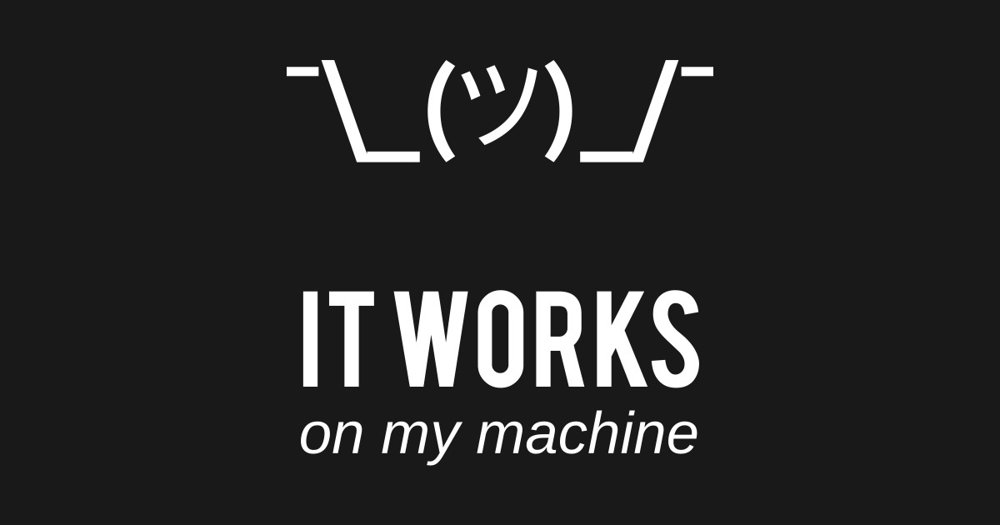
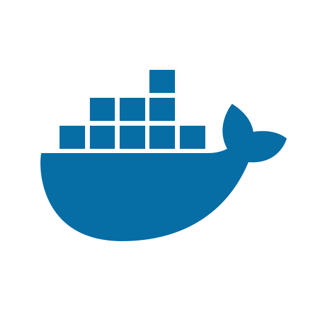

# Do you want to build a snow(flake)?

The road to a better dev environment

---



---

# What do we want?

* Access to as many (up to date) packages/SDKs/toolchains as possible
* Have a way of restoring the exact same package state on multiple machines
  * Including config/env variables
* Way of keeping inventory of what we use
  * Both a resource and security concern
Using as few tools as possible ...

---

# Dev containers
* Containerize development environment, packages, environment variables, etc.
* Every developer (preferably) uses the exact same packages
* Documentation for setting up dev environment always up to date
  * Fast onboarding of new devs

---



# Docker? (for image builds)
* Security, hard to verify actual contents
* Performance, poor use of caching
* Bloated: works in layers, not software features
* Requires internet access to work

<!-- Poor software bill of materials -->
<!-- Caching, Nix does a much better job -->
<!-- Build commands in Dockerfiles end up as metadata in the resulting image -->

---

# Reproducible?

```dockerfile
FROM ubuntu

RUN set -eux;
	apt-get update;
	apt-get install -y --no-install-recommends \
		ca-certificates \
		curl \
	; \
	rm -rf /var/lib/apt/lists/*

COPY . /app

CMD /app/app
```

<!-- ubuntu what? -->
<!-- Chain commands to follow best practices -->
<!-- apt-get is non determenistic/temporal -->
<!-- How is app even built and what version/packages was used?  -->

---

# Reproducible?

```dockerfile
FROM ubuntu # Ubuntu what exactly?

RUN set -eux;
	apt-get update; # apt-get is non determenistic and temporal
	apt-get install -y --no-install-recommends \
		ca-certificates \
		curl \
	; \
	rm -rf /var/lib/apt/lists/* # Cleaning up our garbage I see

COPY . /app # What environment even built this???

CMD /app/app
```

---

# Reproducible?

* 2 people using the same docker image => same results
* 2 people building the same Dockerfile => (very often) different results
* Non dev container scenarios even worse
  * Different distros, slight differences in libraries/build flags etc.

---

# Nix

---

```nix
  fib = n:
    let
      acc = a: b: i:
        if i == n then a else acc b (a + b) (i + 1);
    in
    if n < 2 then n else acc 0 1 0;
```

---


---

# Development shells

* The Nix answer to dev containers
* Clever use of env variables and symlinks contruct the exact desired environment
Can be likened to starting a shell ... like bash for example

---

# Flake projects

* Zed Editor
* Helix Editor
* opencode
* Polars
* rust-analyzer
* Cosmic Desktop
* Hyprland
* zoxide

---

# Flakes

* Effort to modernize nix projects with better tooling
* Provides well defined entrypoints for programs and tools
* Allows pinning of dependencies

---

# Home-Manager

* System for generating NixOS like configuration on generic Linux distributions

---

# Let's begin

https://github.com/oahlen/snowflake
